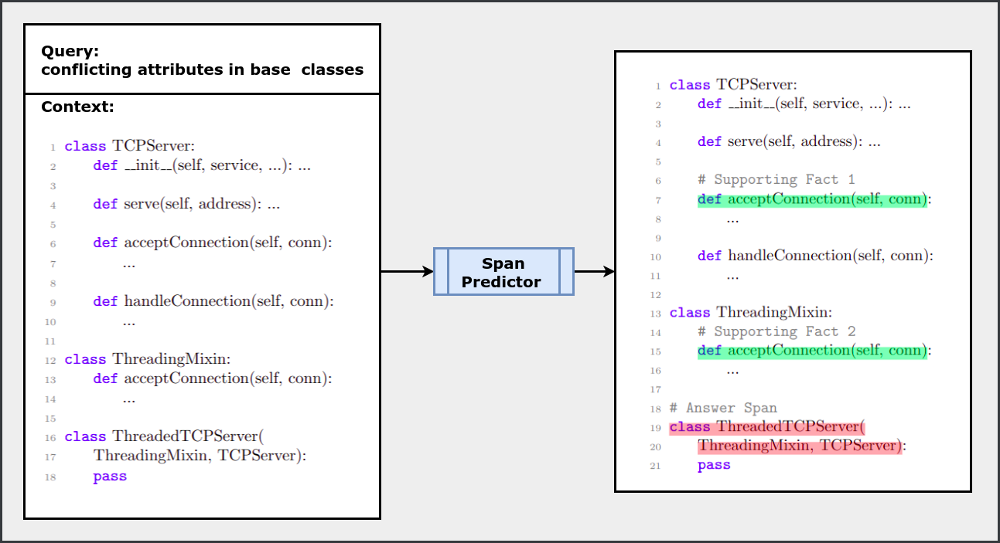

# CodeQueries Benchmark

CodeQueries is a dataset to evaluate various methodologies on answering semantic queries over code. Existing datasets for question-answering in the context of programming languages target comparatively simpler tasks of predicting binary yes/no answers to a question or range over a localized context (e.g., a source-code method). In contrast, in CodeQueries, a source-code file is annotated with the required spans for a code analysis query about semantic aspects of code. Given a query and code, a `Span Predictor` system is expected to identify answer and supporting-fact spans in the code for the query. 

    

More details on the curated dataset for this benchmark are available on [HuggingFace](https://huggingface.co/datasets/thepurpleowl/codequeries).
The repo provides scripts to reproduce the results presented in the paper on [CodeQueries]().

### Steps
-----------
1. Clone the repo in a virtual environment.
2. Run `setup.sh` to setup the workspace.
3. Run the following commands to get performance metric values.   

#### Two-step setup evaluation
`python3 evaluate_spanprediction.py --example_types_to_evaluate=<positive/negative> --setting=twostep --span_type=<both/answer/sf> --span_model_checkpoint_path=<model-ckpt-with-low-data/Cubert-1K-low-data or finetuned_ckpts/Cubert-1K> --relevance_model_checkpoint_path=<model-ckpt-with-low-data/Twostep_Relevance-512-low-data or finetuned_ckpts/Twostep_Relevance-512>`

#### LLM experiment Evaluation
To evaluate zero-shot prompt: `python evaluate_generated_spans.py --g=test_dir_file_0shot/logs`  
To evaluate few-shot prompt with BM25 retrieval: `python evaluate_generated_spans.py --g=test_dir_file_fewshot/logs`  
To evaluate few-shot prompt with supporting facts: `python evaluate_generated_spans.py --g=test_dir_file_fewshot_sf/logs --with_sf=True`

### Experiment results on sampled test data
-----------
#### LLM experiment
<table>
  <thead>
    <tr>
      <th></th>
      <th colspan="2">Zero-shot prompting  (Answer span prediction)</th>
      <th colspan="2">Few-shot prompting with BM25 retrieval  (Answer span prediction)</th>
      <th> Few-shot prompting with supporting fact  (Answer & supporting-fact span prediction)</th>
    </tr>
  </thead>
  <tbody>
    <tr>
      <td>Pass@k</td>
      <td>Positive</td>
      <td>Negative</td>
      <td>Positive</td>
      <td>Negative</td>
      <td>Positive</td>
    </tr>
    <tr>
      <td>1</td>
      <td>9.82</td>
      <td>12.83</td>
      <td>16.45</td>
      <td>44.25</td>
      <td>21.88</td>
    </tr>
    <tr>
      <td>2</td>
      <td>13.06</td>
      <td>17.42</td>
      <td>21.14</td>
      <td>55.53</td>
      <td>28.06</td>
    </tr>
    <tr>
      <td>5</td>
      <td>17.47</td>
      <td>22.85</td>
      <td>27.69</td>
      <td>65.43</td>
      <td>34.94</td>
    </tr>
    <tr>
      <td>10</td>
      <td>20.84</td>
      <td>26.77</td>
      <td>32.66</td>
      <td>70.0</td>
      <td>39.08</td>
    </tr>
  </tbody>
</table>

 #### Two-step setup
 <table>
  <thead>
    <tr>
      <th></th>
      <th colspan="2">Answer span prediction</th>
      <th>Answer & supporting-fact span prediction</th>
    </tr>
  </thead>
  <tbody>
    <tr>
      <td>Variant</td>
      <td>Positive</td>
      <td>Negative</td>
      <td>Positive</td>
    </tr>
    <tr>
      <td>Two-step(20, 20)</td>
      <td>9.42</td>
      <td>92.13</td>
      <td>8.42</td>
    </tr>
    <tr>
      <td>Two-step(all, 20)</td>
      <td>15.03 </td>
      <td>94.49</td>
      <td>13.27</td>
    </tr>
    <tr>
      <td>Two-step(20, all)</td>
      <td>32.87</td>
      <td>96.26</td>
      <td>30.66</td>
    </tr>
    <tr>
      <td>Two-step(all, all)</td>
      <td>51.90</td>
      <td>95.67</td>
      <td>49.30</td>
    </tr>
  </tbody>
</table>

### Experiment results on complete test data
-----------
| Variants                      | Positive     | Negative     |
|-------------------------------|--------------|--------------|
| Two-step(20, 20)              | 3.74         | 95.54        |
| Two-step(all, 20)             | 7.81         | 97.87        |
| Two-step(20, all)             | 33.41        | 96.23        |
| Two-step(all, all)            | 52.61        | 96.73        |
| Prefix                        | 36.60        | 93.80        |
| Sliding window                | 51.91        | 85.75        |
